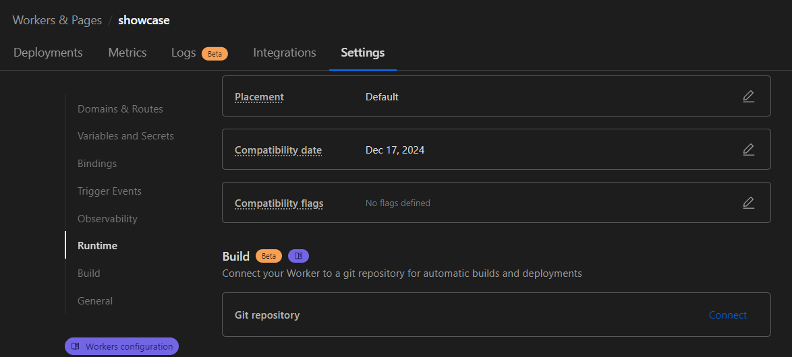

# Cloudflare Primitives Showcase
This is a working showcase of what can be built with the Cloudflare Primitives.

## CI/CD
### Git integration
[Git integration](https://developers.cloudflare.com/pages/configuration/git-integration/)


### Build & deploy commands

Build command: 
```
curl --proto '=https' --tlsv1.2 -sSf https://sh.rustup.rs | sh -s -- -y --profile minimal && export PATH="$HOME/.cargo/bin:$PATH" && rustc --version && rustup update stable && rustup target add wasm32-unknown-unknown && cargo install -q worker-build && worker-build --release
```

Deploy command: 
```
export PATH="$HOME/.cargo/bin:$PATH" && npx wrangler deploy
```

